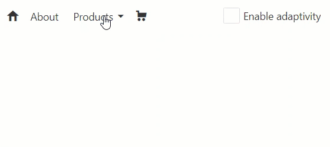

<!-- default badges list -->

<!-- default badges end -->
# DevExtreme Menu - Getting Started 

This repository stores the code examples of the Menu component for the [Getting Started with Menu](https://js.devexpress.com/Documentation/Guide/UI_Components/Menu/Getting_Started_with_Menu/) tutorial. This tutorial explains how to create Menu base level and submenus, process clicks on items, and enable adaptivity mode.

## Files to Review

- **Angular**
    - [app.component.html](angular/src/app/app.component.html)
    - [app.component.ts](angular/src/app/app.component.ts)
- **jQuery**
    - [index.js](jquery/src/index.js)
- **React**
    - [App.js](react/src/App.js)
- **Vue**
    - [App.vue](vue/src/App.vue)

## Documentation

- [Getting Started with Menu](https://js.devexpress.com/Documentation/Guide/UI_Components/Menu/Getting_Started_with_Menu/)

- [Menu - API Reference](https://js.devexpress.com/Documentation/ApiReference/UI_Components/dxMenu/)
